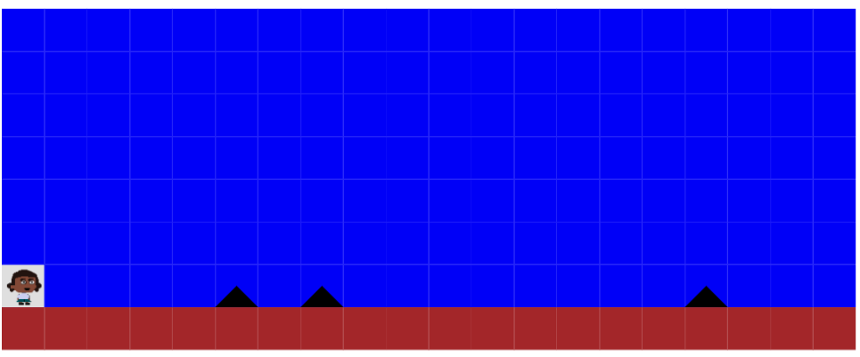

# Spike OOP Game

**School of Code - Week 5 Hackathon**

##### October 2020

This game was built as part of a two-day hackathon where I worked in a pair to design and build a 2D platformer game. This was an opportunity to cement what we had learnt about object oriented programming, as well as planning, ideating and refining an MVP. I was really pleased with our game, we went extra mile building a game that required game physics logic (e.g gravity). We were able to simulate character movement across the platform.

## Hackathon requirements

- Task 1: Choose a game to recreate in code. Use disney ideation, and then break it down to the essence (MVP) and plan what classes you will need, and what state and behavior each class will need. The break each of the behaviors down to a level were you can start coding.
- Task 2: Put each of your classes into a trello board with a todo, doing and done column.
- Task 3: Build Your MVP, get the simplest possible version of your game working.
- Task 4: Choose what your next steps are, what functionality would make the biggest impact. If you've used alert/prompt for your MVP. Display your game on the page either with the DOM or your new canvas games.

## To Start

Clone the repo as instructed below and install npm modules.

## Installation

1.  Clone the repo 
    `https://github.com/kumsw/spike-oop-game.git`
2.  Download the required npm modules. 
    `npm i`
3.  Open a local version of your `index.html` in the browser, for example: 
    `/Users/{YOUR INFO}spike-oop-game/index.html`

## Usage:

Aim of the game: Don't touch the spikes!

Use the arrow keys to move the character across the platform to the the otherside. Use the up and left arrow to jump over the spikes, try not to hit them or you'll have to start your journey again.

Good luck!

## Main learnings:

- Learnt a huge amount about Classes, Methods and object orientated design.

- Learnt about SOLID OOP principles.

- Started thinking more about properties and behaviour. I practiced planning other classic games into this model.

- Canvas: this was the first time we had used HTML canvas to draw graphics on the browser using Javascript.

- I gained an appreciation for the benefits of OOP such as building easily maintainable code, using classes that can be reused and scaled and conceptualisng programming problems by breaking them down into separate parts.

- This was my first experience of game design. I learnt about the implementing game physics, it was great that we managed to implement 'gravity'.

## Stretch goals:

This is not currently an active project but if I had more time I would look to add this functionality:

- It would be great to get another screen loading when the player reaches the end of the level.
- Implement a number of lives so that the game would end and we could then keep score.
